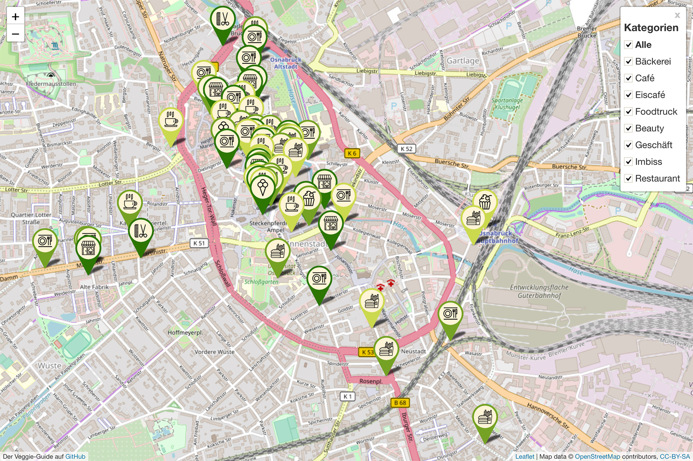

# Veggieguide
Interaktive Karte mit Listenfunktion für Veggie-Angebote in einer Region. 
Den Osnabrücker Veggieguide in Aktion gibt es hier: [Veggieguide der Tierrechtsinitiative Osnabrück](https://www.tierrechtsinitiative-os.de/veggieguide/)

### Icon Lizenzen 
Die Icons innerhalb der Marker sind lizensiert unter Creative Commons CCBY und stammen aus diesen Quellen:
 - Barber Shop by [cindy clegane](https://thenounproject.com/cindyclegane) from the Noun Project 
 - bistro by [Prettycons](https://thenounproject.com/andrei.manolache7) from the Noun Project 
 - Cupcake by [Luiz Carvalho](https://thenounproject.com/luizcarvalhoid) from the Noun Project 
 - Fast Food by [Eucalyp](https://thenounproject.com/eucalyp) from the Noun Project 
 - Food Truck by [Pablo Tournelle](https://thenounproject.com/sspecter777) from the Noun Project 
 - hot drink by [LINECTOR](https://thenounproject.com/linector) from the Noun Project 
 - Ice Cream Cone by [Mega Agustina](https://thenounproject.com/megaagustina067/) from the Noun Project 
 - Place Setting by [Rafael Farias Leão](https://thenounproject.com/rafaleao) from the Noun Project 
 - Settings by [Denis Klyuchnikov](https://thenounproject.com/denis.klyuchnikov.1/) from the Noun Project 

Falls Ihr die Marker auch für euer Projekt verwenden wollt, solltet ihr die Quellen ebenfalls angeben. 

### Lizenz des Veggieguides
Dieses Projekt ist lizenziert unter einer MIT License. 
Wir würden uns natürlich freuen, wenn Ihr uns bei euren Veggieguides verlinkt. :) 
